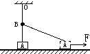
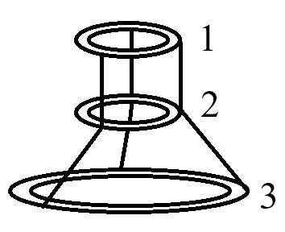

# {{ page.title }}

为方便观看，你可以
<button onclick="alert('题目还没写完呢，别急！')" style="background-color:#63B5D3; color:#ffffff; font-size:24px; border-radius:5px; border:0px solid; padding:8px 10px">获取打印版题目</button> 或
<button onclick="alert('答案解析还没公布呢，别急！')" style="background-color:#63B5D3; color:#ffffff; font-size:24px; border-radius:5px; border:0px solid; padding:8px 10px">获取打印版解析</button>。

## 数学 Mathematics

### 题目 Problems

1. (10')
   (1) 已知函数 $f(x)=\lg\frac{1-x}{1+x}$，若关于 $x$ 的方程 $10^{f(x)}=ax$ 有实数解，求实数 $a$ 的取值范围。
   (2) 已知函数 $f(x)=x^2-1$，若关于 $x$ 的方程 $|f(x)|^2+m|f(x)|+2m+3=0$ 在 $[0,+\infty)$ 上有三个不同的解，求实数 $m$ 的取值范围。

2. (10') 已知函数 $f(x)=\dfrac{1}{\sqrt{x^2+ax+b}}$ 的定义域为非空集合 $A$，函数 $g(x)=\sqrt{kx^2+4x+k+3}$ 的定义域为非空集合 $B$。若 $(\complement_\mathbb{R}A)\cap B=B,(\complement_\mathbb{R}A)\cup B=\lbrace x\|-2\le x\le 3\rbrace$，求实数 $a,b$ 的值以及对应的实数 $k$ 的取值范围。
   
3. (15') 单“规”作图：提供一个生锈的圆规（它两脚间的距离 $r$ 是确定的，无法改变），再给定距离为 $d$ 的两点 $A,B$，求作点 $C$ 使得 $A,B,C$ 三点构成正三角形。（满足 $r>\frac{d}{2}$）

## 物理 Physics

### 题目 Problems

1. (10') 图中 $OA$ 为一遵循胡克定律的弹性轻绳，$OB$ 为原长，劲度系数为 $k$。其一端固定于天花板上的 $O$ 点，另一端与静止在动摩擦因数恒定为 $\mu$ 的水平面上的滑块 $A$ （重 $mg$）相连，当绳处于竖直位置时，滑块 $A$ 与地面接触。$B$ 为紧挨绳的一光滑水平小钉，现用一水平力 $F$ 作用于 $A$，使之向右作直线运动，在运动过程中，地面对 $A$ 的摩擦力如何变化？试求当 $AB$ 与水平面的夹角为 $\theta$ 时，地面对 $A$ 的摩擦力大小 $f$ 和拉力大小 $F$ 的表达式。

   

2. (15') 如图所示，三根不可伸长的相同的光滑细绳，一端系在半径为 $r$ 的环上，间距相等，另一端穿过第二个相同的圆环系在第三个半径为 $2r$ 的圆环上。现把第一个环水平地固定起来，若三个环的材料、粗细都相同，试求当系统平衡时，第二环与第三环圆心间的距离。

   

## 化学 Chemistry

### 题目 Problems

`#undefined`

## 生物 Biology

### 题目 Problems

`#undefined`