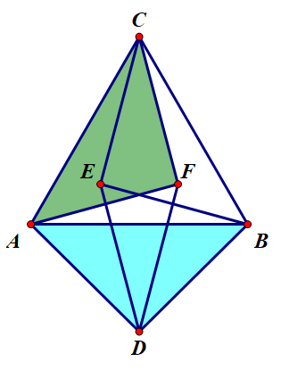

# {{ page.title }}

为方便观看，你可以
<button onclick="window.location.href='https:\/\/robinlee19.lanzout.com\/ifzZ51d4jq4d'" style="background-color:#63B5D3; color:#ffffff; font-size:24px; border-radius:5px; border:0px solid; padding:8px 10px">获取打印版题目</button> 或
<button onclick="window.location.href='https:\/\/robinlee19.lanzout.com\/izSdU1d5242d'" style="background-color:#63B5D3; color:#ffffff; font-size:24px; border-radius:5px; border:0px solid; padding:8px 10px">获取打印版解析</button>。

## 数学 Mathematics

### 题目 Problems

1. (10')
   
   (1) 已知函数 $f(x)=\lg\dfrac{1-x}{1+x}$，若关于 $x$ 的方程 $10^{f(x)}=ax$ 有实数解，求实数 $a$ 的取值范围。
   
   (2) 已知函数 $f(x)=x^2-1$，若关于 $x$ 的方程 $\|f(x)\|^2+m\|f(x)\|+2m+3=0$ 在 $[0,+\infty)$ 上有三个不同的解，求实数 $m$ 的取值范围。

2. (10') 已知函数 $f(x)=\dfrac{1}{\sqrt{x^2+ax+b}}$ 的定义域为非空集合 $A$，函数 $g(x)=\sqrt{kx^2+4x+k+3}$ 的定义域为非空集合 $B$。若 $(\complement_\mathbb{R}A)\cap B=B,(\complement_\mathbb{R}A)\cup B=\lbrace x\|-2\le x\le 3\rbrace$，求实数 $a,b$ 的值以及对应的实数 $k$ 的取值范围。
   
3. (15') 单“规”作图：提供一个生锈的圆规（它两脚间的距离 $r$ 是确定的，无法改变），再给定距离为 $d$ 的两点 $A,B$，求作点 $C$ 使得 $A,B,C$ 三点构成正三角形。（满足 $r>\dfrac{d}{2}$）

### 提示 Hints

1. (1) $10^{\lg{N}}=N$，不过别忘了对数本身对于底数、真数的要求。

   (2) 看起来有些复杂，不过可以试着拆成两部分：设 $\|f(x)\|=y$，不妨先考虑对于每一个确定的 $y$，$x$ 有几个在 $[0,+\infty)$ 上的解，再考虑关于 $y$ 的方程 $y^2+my+2m+3=0$ 的根的情况。

2. $f(x),g(x)$ 的定义域意味着什么？在此题中，应当是使得根号下代数式非负、分母上代数式非零。于是此题转化为了一道二次函数题。

3. 单规作图题，试着画画就很容易做出来。如何证明？

### 答案与解析 Answer Key

1. (1) 由题可知，$\frac{1-x}{1+x}>0$，解得 $x\in(-1,1)$。

   则原题化为：关于 $x$ 的方程 $10^{f(x)}=\frac{1-x}{1+x}=ax$ 在 $(-1,1)$ 上有实数解，求 $a$ 的取值范围。

   即 $f(x)=ax^2+(a+1)x-1$ 在 $(-1,1)$ 上有至少一个零点。

   首先，不难发现 $f(x)$ 图像恒过 $(-1,-2)$，且过 $(1,2a)$。

   I. 当 $a=0$ 时，$f(x)=x-1$，零点为 $1\notin(-1,1)$，不合题。

   II. 当 $a>0$ 时，$2a>0$。由**零点定理**可知 $f(x)$ 在 $(-1,1)$ 上存在零点，合题。

   III. 当 $a<0$ 时，对函数有如下要求：

   $\begin{cases}
      \Delta \ge 0 \\\\\\
      x_0=-\frac{a+1}{2a} \in (-1,1)
   \end{cases}\Leftrightarrow a\le-3-2\sqrt{2}$。

   综上所述，$a\in(-\infty,-3-2\sqrt{2}]\cup(0,+\infty)$。

   > 零点定理
   > 
   > 设函数 $f(x)$ 在闭区间 $[a,b]$ 上连续，且 $f(a)$ 与 $f(b)$ 异号（即 $f(a)\cdot f(b)<0$），那么在开区间 $(a,b)$ 内至少有函数 $f(x)$ 的一个零点，即至少有一点 $\xi(a<\xi<b)$ 使 $f(\xi)=0$。

   (2) 设 $\|f(x)\|=y$，则对于确定的 $y$，$x$ 的非负实数解的个数 $=\begin{cases}
      1, & y=0\ \text{or}\ y\ge 1\\\\\\
      2, & 0<y<1
   \end{cases}$

   再考察关于 $y$ 的方程 $y^2+my+2m+3=0$，它应当在 $[0,+\infty)$ 上有两根，且有且仅有一根位于 $(0,1)$。

   I. 当一根为 $0$ 时，另一根位于 $(0,1)$：

   于是 $2m+3=0$，即 $m=-\frac{3}{2}$，代入原方程再解得 $y_1=0,y_2=\frac{3}{2}\notin(0,1)$，故不合题，舍去。

   II. 当一根位于 $(0,1)$，另一根位于 $[1,+\infty)$ 时，对函数有如下要求：

   $\begin{cases}
      \Delta \ge 0\\\\\\
      y_1+y_2=-m > 0\\\\\\
      y_1 y_2=2m+3 > 0\\\\\\
      (y_1-1)(y_2-1)\le 0\\\\\\
   \end{cases}\Leftrightarrow m\in(-\frac{3}{2},-\frac{4}{3}]$。

   当 $m=-\frac{4}{3}$ 时，经检验合题。

   综上所述，$m\in(-\frac{3}{2},-\frac{4}{3}]$。

2. 由题，$A=\lbrace x\|x^2+ax+b>0\rbrace,B=\lbrace x\|kx^2+4x+k+3\ge 0\rbrace$。

   而因为 $(\complement_\mathbb{R}A)\cap B=B$，所以 $B \subseteq \complement_\mathbb{R}A$，又因为 $(\complement_\mathbb{R}A)\cup B=\lbrace x\|-2\le x\le 3\rbrace$，所以 $\complement_\mathbb{R}A=\lbrace x\|-2\le x\le 3\rbrace$，所以 $A=(-\infty,-2)\cup(3,+\infty)$。

   于是关于 $x$ 的方程 $x^2+ax+b=0$ 的两根为 $-2$ 和 $3$。解得 $a=-1,b=-6$，经检验合题。

   于是只要考察 $B\subseteq [-2,3]$。

   I. 当 $k=0$ 时，$B=\lbrace x\|4x+3\ge 0 \rbrace$，显然不合题。

   II. 当 $k\neq 0$ 时，分析可知 $k<0$，对函数 $f(x)=kx^2+4x+k+3$ 有如下要求：

   $\begin{cases}
      \Delta \ge 0 \\\\\\
      f(-2)\le 0 \\\\\\
      f(3)\le 0 \\\\\\
      x_0=-\frac{4}{2k}\in [-2,3]
   \end{cases} \Leftrightarrow k\in[-4,-\frac{3}{2}]$。

   综上所述，$a=-1,b=-6,k\in[-4,-\frac{3}{2}]$。

3. **Tips: 本题有[视频讲解](https://www.bilibili.com/video/BV1ay4y1w7yP/?share_source=copy_web&vd_source=b22f39d6e6720522e3d885955457b2fb)<strike>，别忘了一键三连（夹带私货）！</strike>**

   作法：分别以 $A,B$ 为圆心，$r$ 为半径作圆，一交点记为 $D$。以 $D$ 为圆心，$r$ 为半径作圆，与 $\odot{A},\odot{B}$ 分别交于异于 $A,B$ 的两点 $F,E$。分别以 $E,F$ 为圆心，$r$ 为半径作圆交于点 $C$，则点 $C$ 即为所求。

   证明：由题，$\triangle{BDE}$ 为正三角形，四边形 $CEDF$ 为菱形，所以 $CF,BE$ 夹角为 $60^{\circ}$。由“手拉手模型”的逆定理，可证明 $\triangle{ADB}≌\triangle{AFC}$，故可证 $\triangle{ABC}$ 为正三角形。

## 物理 Physics

### 题目 Problems

1. (10') 图中 $OA$ 为一遵循胡克定律的弹性轻绳，$OB$ 为原长，劲度系数为 $k$。其一端固定于天花板上的 $O$ 点，另一端与静止在动摩擦因数恒定为 $\mu$ 的水平面上的滑块 $A$ （重 $mg$）相连，当绳处于竖直位置时，滑块 $A$ 与地面接触，此时 $AB$ 长为 $L$。$B$ 为紧挨绳的一光滑水平小钉，现用一水平力 $F$ 作用于 $A$，使之向右作直线运动，在运动过程中，地面对 $A$ 的摩擦力如何变化？试求当 $AB$ 与水平面的夹角为 $\theta$ 时，地面对 $A$ 的摩擦力大小 $f$ 的表达式。

   

2. (15') 如图所示，三根不可伸长的相同的光滑细绳，一端系在半径为 $r$ 的环上，间距相等，另一端穿过第二个相同的圆环系在第三个半径为 $2r$ 的圆环上。现把第一个环水平地固定起来，若三个环的材料、粗细都相同，试求当系统平衡时，第二环与第三环圆心间的距离。

   

### 答案 Answer Key

1. $f=\mu N=\mu(G-T_y)=\mu(mg-k\cdot A'B\cdot \sin \theta)=\mu(mg-k\cdot AB)=\mu (mg-kL)=\mu mg-\mu kL$

2. 对第二个环受力分析：$3T=mg+2mg$。
   
   对第三个环受力分析：$2mg=3T\sin\alpha$（$\alpha$ 为 $T$ 与水平面夹角）。

   所求圆心距 $d=(2r-r)\tan\alpha=\frac{2}{\sqrt{5}}r=\frac{2\sqrt{5}}{5}r$。

## 化学 Chemistry

### 题目 Problems

1. (20') $45\ \text{cm}^3\ \text{CO},\text{CH}_4,\text{C}_2\text{H}_2$ 的混合气体与 $100\ \text{cm}^3\ \text{O}_2$ 完全燃烧并冷却到室温且干燥后，体积变为 $80\ \text{cm}^3$；用 $\text{KOH}$ 吸收 $\text{CO}_2$ 之后，体积缩减为 $15\ \text{cm}^3$。求原混合气体中 $\text{CO},\text{CH}_4,\text{C}_2\text{H}_2$ 的体积分数。

### 答案与解析 Answer Key

1. 写出三种化合物燃烧的化学方程式：

   $2\text{CO}+\text{O}_2=2\text{CO}_2,\text{CH}_4+2\text{O}_2=\text{CO}_2+2\text{H}_2\text{O},2\text{C}_2\text{H}_2+5\text{O}_2=4\text{CO}_2+2\text{H}_2\text{O}$。

   每燃烧 $1\ \text{mol}$ 上述三种化合物生成 $\text{CO}_2$ 的物质的量分别为 $1\ \text{mol},1\ \text{mol},2\ \text{mol}$。

   由题，总共生成 $\text{CO}_2$ 的体积为 $65\ \text{cm}^3$，由“鸡兔同笼”原理可知原气体中 $\text{C}_2\text{H}_2$ 的体积为 $20\ \text{cm}^3$，对应的体积分数为 $\frac{4}{9}\approx44\%$。同时，原气体中 $\text{CO}$ 和 $\text{CH}_4$ 的体积和为 $25\ \text{cm}^3$。

   注意到，每燃烧 $1\ \text{mol}\ \text{CO}$ 会消耗 $0.5\ \text{mol}\ \text{O}_2$；而每燃烧 $1\ \text{mol}\ \text{CH}_4$ 会消耗 $2\ \text{mol}\ \text{O}_2$；而燃烧了 $20\ \text{cm}^3\ \text{C}_2\text{H}_2$ 消耗了 $50\ \text{cm}^3\ \text{O}_2$。又已知氧气的原体积为 $100 \ \text{cm}^3$，剩余的 $15 \ \text{cm}^3$ 气体全都是氧气，故燃烧 $\text{CO}$ 和 $\text{CH}_4$ 共消耗了 $100-15-50=35\ \text{cm}^3$ 的氧气。由“鸡兔同笼”原理可知，原气体中 $\text{CO}$ 的体积为 $10\ \text{cm}^3$，对应的体积分数为 $\frac{2}{9}\approx22\%$；$\text{CH}_4$ 的体积为 $15\ \text{cm}^3$，对应的体积分数为 $\frac{3}{9}\approx33\%$。

   综上所述，原题答案为“$22\%,33\%,44\%$”。

## 生物 Biology

### 题目 Problems

`#undefined`