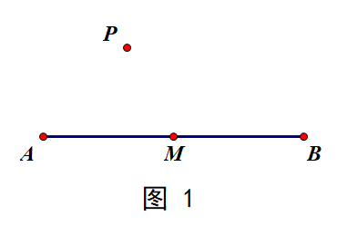
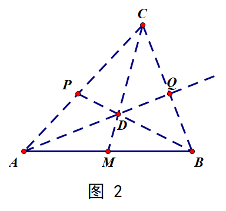
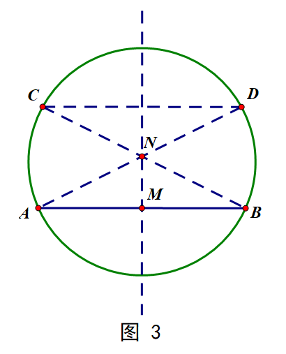
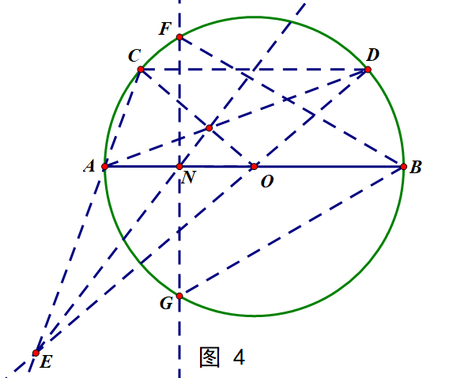

# {{ page.title }}

## 数学 Mathematics

### 题目 Problems

1. (4') 设关于 $x$ 的函数 $f(x),g(x),h(x)=kx+b\ (k,b\in\mathbb{R})$，在区间 $D$ 上恒有 $f(x)\ge g(x)\ge h(x)$。
   
   若 $f(x)=x^2+2x,g(x)=-x^2+2x,D=(-\infty,+\infty)$，求 $h(x)$ 的表达式。

2. (10') 已知 $0<a,b,c<1,ab+bc+ca=1$，求证：$\frac{a}{1-a^2}+\frac{b}{1-b^2}+\frac{c}{1-c^2}\ge \frac{3\sqrt{3}}{2}$.

3. (16') 单尺作图：给定一圆及其圆心，求作其一内接正三角形。

4. [Ex.] 设 $n=\sum{a_i\times k^i}\ (a_i\in \mathbb{Z}\cap[0,k))$，则记 $(n)_k=\\{ a_m \\}^①$，称为 $n$ 的 $k$ 进制表示。
   
   试判断命题“$(\sqrt{3})_3$ 中含有无穷多个 $0$、$1$、$2$”的正确与否，并说明理由。

   ① 此处对数列下标进行拓展，使其能够取遍 $\mathbb{Z}$。

### 提示 Hints

1. 此题中 $f(x),g(x)$ 有何特点？$D=(-\infty,+\infty)$ 意味着什么？$h(x)$ 的表达式唯一吗？
   
2. 利用**基本不等式**的变形，是什么呢？

3. 利用**塞瓦定理**作图。

### 答案 Answer Key

1. $h(x)=2x$.

2. 首先证明一个引理：$a^2+b^2+c^2\ge ab+bc+ca$，当且仅当 $a=b=c$ 时取等。

   证明：移项后配方可得。

   在原题中，设 $A=a(1-a^2)$，则 $A^2=a^2(1-a^2)^2=\frac{1}{2}\times 2a^2(1-a^2)(1-a^2)\le \frac{1}{2}\times(\frac{2}{3})^3=\frac{4}{27}$，当且仅当 $2a^2=1-a^2$，即 $a^2=\frac{1}{3},a=\frac{\sqrt{3}}{3}$ 时取等。

   所以 $A\le \frac{2}{3\sqrt{3}}$，当且仅当 $a=\frac{\sqrt{3}}{3}$ 时取等。

   在原题左式中，$\text{LHS}=\frac{a^2}{a(1-a^2)}+\frac{b^2}{b(1-b^2)}+\frac{c^2}{c(1-c^2)}\ge \frac{3\sqrt{3}}{2}(a^2+b^2+c^2)\ge \frac{3\sqrt{3}}{2}(ab+bc+ca)=\frac{3\sqrt{3}}{2}$，当且仅当 $a=b=c=\frac{\sqrt{3}}{3}$ 时取等。

3. 首先规定三个基本操作：“中点→平行”、“平行→中点”与“单尺作中垂线”。

   “中点→平行”：给定一条线段的中点，必能作出过 线段所在直线外一点 的与原线段平行的直线。

   证明过程如下：

   如图 1，给定线段 $AB$ 与其中点 $M$，求作过 线段所在直线外一点$P$ 的直线 $l \parallel AB$。
   
   

   作法：如图 2，连接 $AP$（$BP$ 亦可，此处以 $AP$ 为例）并延长至一点 $C$，连接 $MC,BP$ 交于 $D$，连接 $AD$ 并延长交 $BC$ 于点 $Q$，则直线 $PQ$ 即为所求。

   证明：由 **塞瓦定理** 可知，在 $\triangle{ABC}$ 中，有 $\frac{AP}{PC}\cdot\frac{CQ}{QB}\cdot\frac{BM}{MA}=1$，因为 $BM=AM$，所以 $\frac{CP}{PA}=\frac{CQ}{QB}$，则易证 $PQ\parallel AB$。

   

   “平行→中点”的操作与证明类似。

   “单尺作中垂线”：在圆中，给定一条线段及其中点，则可作出其中垂线。

   作法：如图 3，设圆心为 $O$，在 $\odot{O}$ 上任取一条弦 $AB$，取其中点 $M$。则按照“中点→平行”的操作作出任意一条 $l\parallel AB$ 且 $l$ 是 $\odot{O}$ 的割线。记 $l$ 与 $\odot{O}$ 的两交点为 $C,D$（左 $C$ 右 $D$），连接 $AD,BC$ 交于 $N$，则直线 $MN$ 即为线段 $AB$ 的中垂线。

   证明：由 $AB\parallel CD$ 可知四边形 $ABDC$ 为等腰梯形。则其对角线交点位于上下底的中垂线上。等腰梯形对角线交点与任一条底边的中点可以确定两底边的中垂线（是同一条）。

   

   由此我们可以完成如下操作：

   如图 4，作任意一条直径 $AB$，由“中点→平行”操作作出一条直线 $l\parallel{AB}$ 交 $\odot{O}$ 于 $C,D$（左 $C$ 右 $D$），作出直线 $AC,OD$ 的交点 $E$，再由“平行→中点”的操作在 $\triangle{CDE}$ 中作出 $AO$ 中点 $N$。然后用“单尺作中垂线”的方法作出 $AO$ 的中垂线，其与圆的两交点 $F,G$ 与端点 $B$ 构成一个等边三角形。

   

## 物理 Physics

### 题目 Problems

1. 一根长为 $L$ 的均匀细绳静止水平地放在光滑的水平桌面上。现有一小虫 $P$ 从细绳的 $A$ 端向 $B$ 端出发，以相对其脚下绳段的匀速 $u$ 行进。同时，细绳的 $B$ 端受到拉力作用以匀速 $v$ 向右作匀速运动。求小虫爬到 $B$ 端所用的时间 $t_e$。

### 提示 Hints

1. $B$ 端运动使绳各部分之间有相对运动，绳的整体不可作为小虫运动的参考物。严格而言，不宜说“小虫开始从 $A$ 端出发以相对绳的匀速度 $u$ 在绳上朝 $B$ 端爬去”，但是可以说“……以相对其足下绳段的匀速度 $u$ 在绳上朝 $B$ 端爬去”。因为小虫已按习惯模型化为质点，“其足下的绳段”当为无穷短绳段，无穷短时间内此绳段各部分间相对运动可略，故可取为该时刻附近小虫爬行运动的“瞬时”参考系。

### 答案 Answer Key

1. 如图所示，在原长的绳上建立从 $A$ 到 $B$ 的 $x$ 坐标，$x_A=0,x_B=L$。设 $t$ 时刻小虫 $P$ 处于 $x$ 坐标上的 $x$ 位置，此时绳的真实长度已成为 $L+vt$，即 $x_B=L$ 已对应真实长度坐标的 $x_B'=L+vt$，绳中 $x$ 坐标对应真实长度为 $x'=x\times\frac{L+vt}{L}$。
   
   

   小虫 $P$ 相对其足下绳段不动，绳端 $B$ 的运动会使 $x'$ 有增量 $\text{d}x_1'=\frac{x}{L}v\text{d}t$。因 $x$ 不会变化，故对小虫 $P$ 爬绳无贡献。
   
   再令绳端 $B$ 不动，小虫 $P$ 相对其足下绳段运动，使 $x'$ 的增量 $\text{d}x_2'$ 对应有 $x$ 的增量 $\text{d}x$，其间关系为 $u\text{d}t=\text{d}x_2'=\frac{\text{d}x}{L}(L+vt)$。

   由此可得 $\int_0^{t_e}\frac{Lu}{L+vt}\text{d}t=\int^L_0\text{d}x$，即 $t_e=\frac{L}{v}(e^{\frac{v}{u}}-1)$ 。

## 化学 Chemistry

`#undefined`

## 生物 Biology

### 题目 Problems

1. 水是生命的源泉，节约用水是每个人应尽的责任，下列有关水在生命活动中作用的叙述，错误的是(    )。
   
   A. 水是酶促反应的环境
   
   B. 参与血液中缓冲体系的形成
   
   C. 可作为维生素 D 等物质的溶剂
   
   D. 可作为反应物参与生物氧化过程

### 提示 Hints

1. 生物体内的水分为自由水和结合水两种。
   
   自由水以游离的形式存在，参与细胞中各种代谢活动。

   自由水的作用：
   
   ① 自由水是良好的溶剂，细胞生命活动所需的许多离子、分子都可以溶解其中；
   
   ② **[B] 自由水可以自由流动，溶解在水中的各种物质随着水的流动到达生物体各处，被细胞吸收和利用，细胞代谢产生的废物一般也借助于水排出体外；**
   
   ③ **[A] 细胞中几乎所有的生化反应都是以自由水为介质进行的；**
   
   ④ **[D] 有些水还直接作为反应物参与生化反应。**
   
   在代谢旺盛的细胞中，自由水的含量一般比较高。

   结合水是被细胞内其他物质（如蛋白质）束缚而不易自由流动的水，是组成细胞的重要成分。

   细胞内结合水的含量相对较多，抵抗不良环境的能力也较强。

   细胞中的水对于维持细胞的形态、保证细胞代谢的正常进行具有重要作用。

2. 脂质是生物体的重要组成成分，对维持细胞结构和功能有重要作用。
   
   脂质主要由 $\text{C}$、$\text{H}$、$\text{O}$ 三种元素组成。
   
   **[C1] 脂质一般不溶于水。**
   
   脂肪、磷脂、固醇类和蜡都属于脂质。

   **[C2] 固醇类分子包括胆固醇、性激素和<u> 维生素 D </u>等。**

### 答案 Answer Key

1. [Unofficial] C