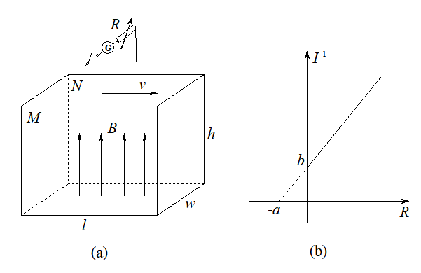

# {{ page.title }}

为方便观看，你可以
<button onclick="window.location.href='https:\/\/robinlee19.lanzout.com\/ihZrH2rcv30b'" style="background-color:#63B5D3; color:#ffffff; font-size:1.3em; border-radius:5px; border:0px solid; padding:5px 5px">获取打印版题目</button>。

## 数学 Mathematics

### 题目 Problems

1. \[USTC 营一 T1\] 已知椭圆 $\dfrac{x^2}{9}+y^2=1$ 与曲线 $xy=t$ 有四个交点。

   (1) 求 $t$ 的取值范围；

   (2) 求这四个交点所构成四边形的面积随 $t$ 变化的表达式 $S(t)$。

2. \[USTC 营一 T2\] 求实数 $a$ 的取值范围，使得 $x^4+3x^3-7x-a=0$ 在 $(0,+\infty)$ 上有且仅有一解。

3. \[USTC 营一 T3\] 数列 $\{a_n\}$ 满足如下条件：\\
$a_0>0, a_1>0, a_{2n}=\dfrac{1+a_{2n-1}}{a_{2n-2}}, a_{2n+1}=\dfrac{1+a_{2n}^2}{a_{2n-1}}.\ (n\ge 1)$\\
求证：$\{a_n\}$ 是周期数列，即存在正整数 $m$，使得对于任意正整数 $n$ 有 $a_n=a_{n+m}$。

## 物理 Physics

### 题目 Problems

1. \[USTC 营一\] 利用如图 (a) 所示的装置测量导电液体（含大量正、负离子）的电导率及磁场强度。装置为管道的一部分，近似看作长方体，长、宽、高分别为 $l,w,h$。其中装有速度恒定向右、大小为 $v$ 的导电液体，整个装置处于向上的匀强磁场中。下板绝缘，前板 ($M$)、后板 ($N$) 为导体。$M,N$ 两板间接有电流表（内阻为 $R_g$）与电阻箱 $R$。\\
\\
测量结果如图 (b) 所示。$I$ 为电流表示数，$R$ 为对应电阻箱阻值。图线所在直线与坐标轴交于 $(0,b), (-a,0)$ 两点。\\
根据上述实验过程及数据，表示出磁场强度 $B$ 与导电液体的电导率 $\rho$。